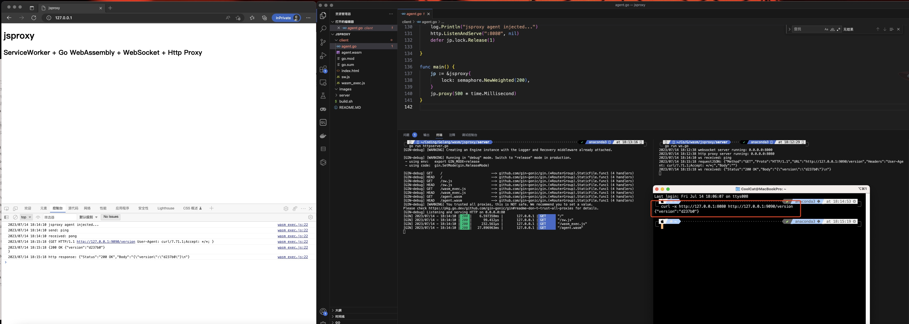

# JsProxy: 所到之处皆为代理节点

### 项目简介

这是一个利用浏览器当代理的demo项目,让所有访问者的浏览器成为自己的代理池，所到之处皆为代理节点.

### 技术细节

使用了以下技术栈：
```
ServiceWorker + Go WebAssembly + WebSocket + Http Proxy
```
主要分为两个部分：

1.服务端：监听了两个端口，一个是http代理端口，一个是ws端口，http代理端口收到请求信息后通过ws传给访问者浏览器的wasm程序来处理。

2.客户端：用sw将wasm程序驻留在浏览器，然后通过ws与服务端建立联系，执行完服务端发送的请求后传给服务端做进一步处理。

### 使用说明

```
# 编译wasm
git clone https://github.com/TheKingOfDuck/jsproxy.git
cd jsproxy
#修改第82行中的localhost为自己的ip
nano client/agent.go
./build.sh

# 公网机器
# 启动http server
cd server
go mod tidy
go run httpserver.go

# 启动主程序
go run ws.go
```



### 已知弊端
1.支持不了socks5,因为浏览器不支持发送tcp包。
2.这只是随手写的demo，很多东西实战没有考虑进去。

